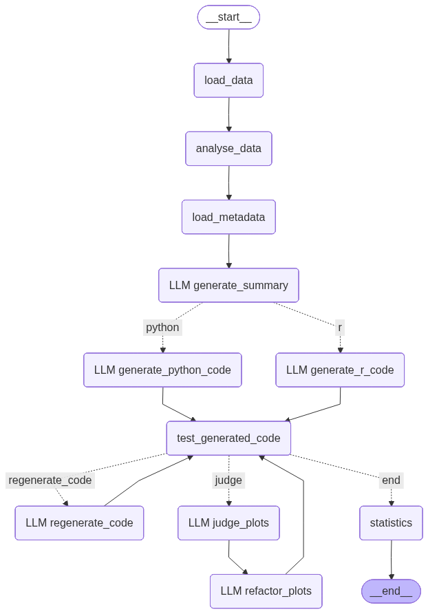

# Data-Science-Agent

## Description

The Data-Science-Agent is an agent pipeline designed to analyse datasets, generate insights, and produce visualizations. It leverages various data science libraries and tools to facilitate data exploration.

## Setup Instructions
This project uses `uv` for dependency management. To set up the project, follow these steps:
1. **Install `uv`**: If you haven't already, install `uv` by following the instructions on the [uv GitHub repository](https://github.com/astral-sh/uv)
2. **Clone the Repository**: Clone this repository to your local machine.
    ```bash
    git clone https://github.com/Elsper01/data-science-agent.git
    cd data-science-agent
    ```
3. **Install Dependencies**: Use `uv` to create a new virtual environment and install the project dependencies.
    ```bash
    uv venv
    touch ./.venv/Scripts/activate
    uv pip install -e .
    ```
4. **Setup & Run the Agent**: Create a `.env` file and add your open-router / open-ai key. For other configurations, refer to the .env section.
    ```bash
    cd ./src/data_science_agent/
    touch .env
    cd ../..
    python ./src/data_science_agent/agent.py
    ```
   
5. **Run Jupyter Notebooks**: Run and edit Jupyter Notebooks in the repo with `uv`.
    ```bash
    uv run --with jupyter jupyter lab
    ```
   The prompted URL and token can be used to access the Jupyter Lab interface in your web browser or added in your IDE as external server.

## .env Configuration
In order to run the Data-Science-Agent, you need to create a `.env` file in the root directory of the project. This file should contain the following environment variables:

```env
OPENROUTER_API_KEY=<your_openrouter_api_key> # this agent was developed with open-route to test more different models
AGENT_LANGUAGE=<your_preferred_language> # Optional. Valid options are: `en`, `de`. Default is `de`. This specifies the language the agent will use intern and for outputs.
MAX_REGENERATION_ATTEMPTS=<your_max_regeneration_attempts> # Optional. Default is `3`. This specifies the maximum number of attempts the agent will make to regenerate outputs in case of failures.
```

## Project Structure

```
my-project/
├── src/
│   └── data_science_agent/
│       ├── dtos/       # language specific DTO's used for structered LLM outputs
│       ├── graph/      # represents the workflow used in the agent pipeline
│       ├── language/   # language specific prompts and templates
│       ├── pipeline/   # all used agents and tools in the steps of the pipeline
│       ├── utils       # utility functions and helpers
│       ├── __init__.py
│       ├── agent.py    # main script to run the Data-Science-Agent
│       └── test.py     # script for fast forward testing the functionality of the agent pipeline
├── pyproject.toml
├── README.md
└── uv.lock
```

## Agent Workflow


[//]: # (# TODO: Add more details about the agent's workflow and functionalities.)

